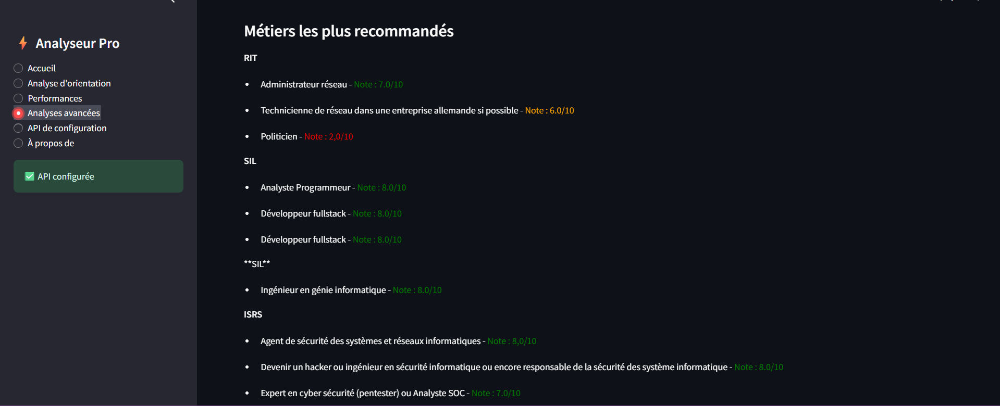
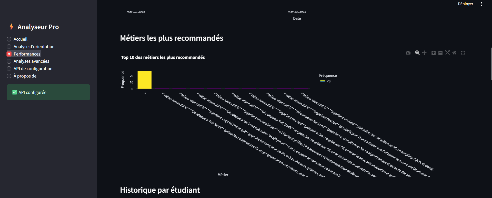
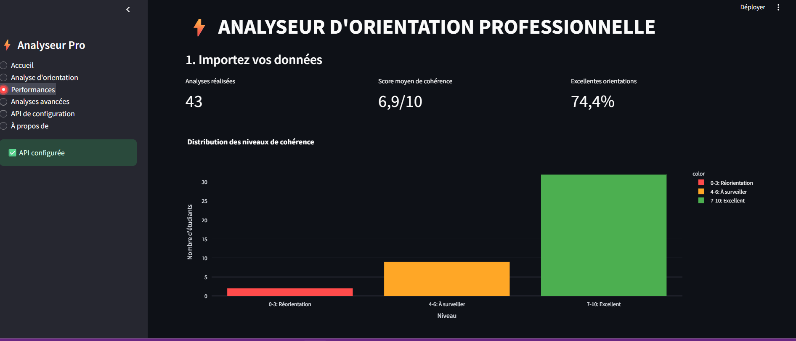
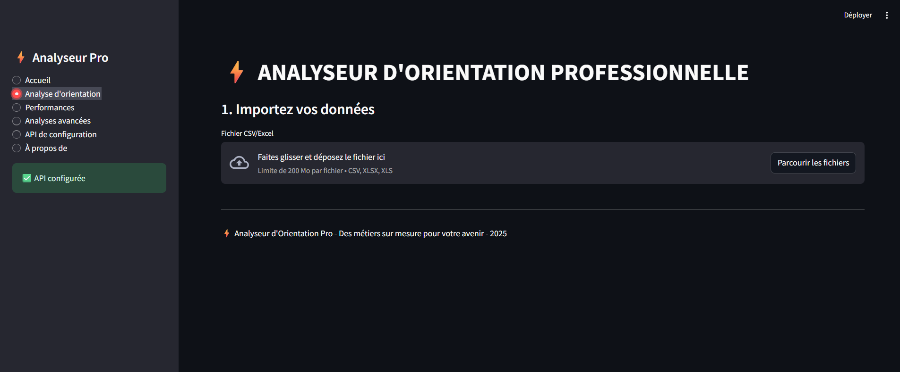
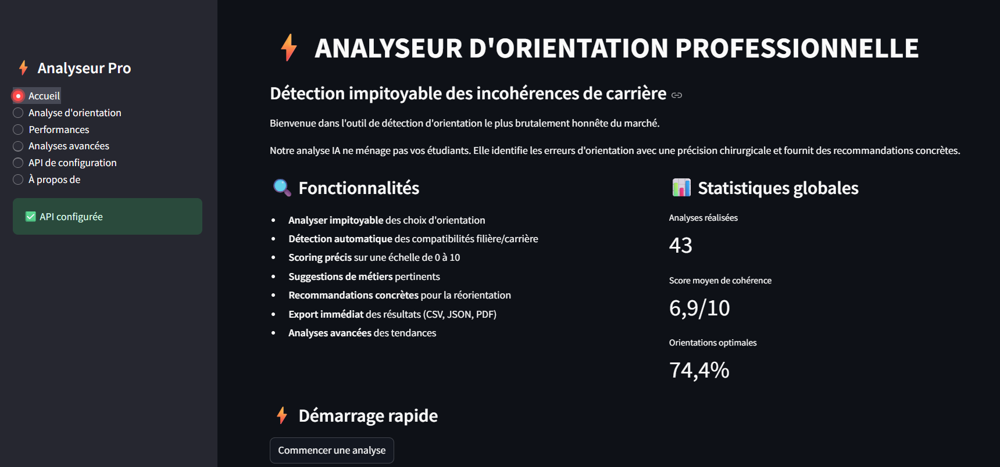

# Analyseur d'Orientation Professionnelle ⚡


Application d'analyse d'orientation utilisant l'IA pour évaluer la cohérence entre filières d'études et carrières visées. L'application attribue un score de cohérence (0-10), propose des métiers alternatifs, et fournit des recommandations personnalisées.

## 🚀 Fonctionnalités

- **Analyse d'orientation IA** - Détection automatique des compatibilités filière/carrière
- **Scoring précis** - Évaluation sur une échelle de 0 à 10
- **Suggestions de métiers** - Recommandations personnalisées basées sur les compétences
- **Tableau de bord avancé** - Visualisations interactives et analyses de tendances
- **Export multi-formats** - Rapports PDF, CSV et JSON
- **Analyses avancées** - Matrices de compatibilité, nuages de mots, analyses statistiques

## 📊 Captures d'écran





## 🛠️ Installation

```bash
# Cloner le repository
git clone https://github.com/iamferdinand255/orientation_analyzer
cd orientation-analyzer

# Créer un environnement virtuel
python -m venv venv
source venv/bin/activate  # Sur Windows : venv\Scripts\activate

# Installer les dépendances
pip install -r requirements.txt

# Configurer l'API
cp .env.example .env
# Remplir le fichier .env avec votre clé API OpenRouter

# Lancer l'application
streamlit run app.py
```

## 📋 Format des données

L'application accepte des fichiers CSV ou Excel avec la structure suivante :

| Nom | Filière | Carrière |
|-----|---------|----------|
| Alice Martin | Informatique | Développeuse web |
| Thomas Dubois | Marketing | Consultant SEO |
| ... | ... | ... |

## ⚙️ Configuration API

L'application nécessite une clé API OpenRouter pour fonctionner :

1. Créez un compte sur [OpenRouter](https://openrouter.ai)
2. Générez une clé API dans votre tableau de bord
3. Ajoutez la clé dans le fichier `.env` ou directement dans l'interface

## 📈 Cas d'utilisation

- **Universités et écoles** - Validation des choix d'orientation des étudiants
- **Centres d'orientation** - Recommandations personnalisées basées sur les compétences
- **Services RH** - Analyse des reconversions professionnelles
- **Organismes de formation** - Évaluation de la pertinence des formations
- **Individus** - Auto-évaluation de cohérence entre formation et aspirations

## 🧠 Fonctionnement technique

L'application utilise un framework d'analyse en plusieurs étapes :

1. **Extraction des données** - Lecture et préparation des fichiers d'entrée
2. **Analyse IA** - Utilisation de l'API OpenRouter avec un prompt structuré
3. **Traitement des résultats** - Extraction du score et des recommandations
4. **Visualisation** - Génération de graphiques et tableaux interactifs
5. **Export** - Préparation et génération des rapports

L'algorithme de scoring évalue la cohérence selon cette échelle :
- **0-3** : Réorientation nécessaire (écart important)
- **4-6** : À surveiller (ajustements recommandés)
- **7-10** : Excellent choix (forte cohérence)

## 🔜 Développements futurs

- [ ] Interface multilingue (FR/EN)
- [ ] Mode hors-ligne avec modèle local
- [ ] API RESTful pour intégration tierce
- [ ] Dashboard admin pour suivi de cohortes
- [ ] Module d'analyse des compétences techniques
- [ ] Intégration avec plateformes éducatives

## 🤝 Contribution

Les contributions sont bienvenues ! N'hésitez pas à ouvrir une issue ou proposer une pull request.

```bash
# Pour contribuer
1. Forkez le projet
2. Créez une branche pour votre fonctionnalité (`git checkout -b feature/amazing-feature`)
3. Committez vos changements (`git commit -m 'Add some amazing feature'`)
4. Poussez vers la branche (`git push origin feature/amazing-feature`)
5. Ouvrez une Pull Request
```

## 📄 Licence

Ce projet est sous licence MIT - voir le fichier [LICENSE](LICENSE) pour plus de détails.

## 📞 Contact

Fernandez KOUAGOU - [@fernandez_KGU](https://x.com/LabFerdi74923) - thelabofferdi@gmail.com

Lien du projet: https://github.com/iamferdinand255/orientation_analyzer